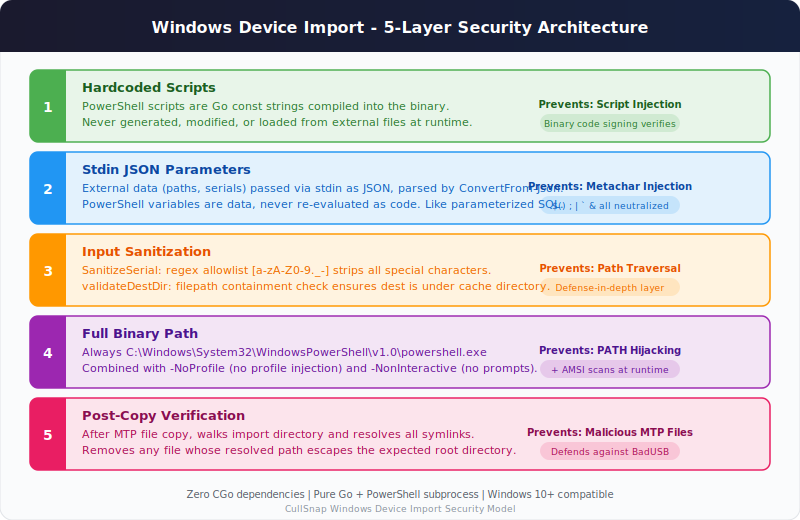

<p align="center">
  
</p>

<h1 align="center">CullSnap</h1>

<p align="center">
  <strong>A blazing-fast, native desktop photo &amp; video culling tool for photographers.</strong>
</p>

<p align="center">
  <a href="go.mod"></a>
  <a href="wails.json"></a>
  <a href="https://github.com/Abhishekmitra-slg/CullSnap/releases/latest"></a>
  <a href="LICENSE"></a>
</p>

<p align="center">
  <a href="#-installation">Install</a> &middot;
  <a href="#-features">Features</a> &middot;
  <a href="#-usage-guide">Usage</a> &middot;
  <a href="#-architecture">Architecture</a> &middot;
  <a href="#-contributing">Contributing</a> &middot;
  <a href="#-license">License</a> &middot;
  <a href="https://github.com/Abhishekmitra-slg/CullSnap/releases/latest">Download</a>
</p>

---

CullSnap lets photographers review, rate, deduplicate, and export thousands of photos and videos from a single native window. The Go backend handles heavy lifting (perceptual hashing, parallel thumbnail generation, FFmpeg video trimming) while the React frontend delivers a responsive glassmorphism UI with virtualized scrolling.

## ✨ Features

-   **Fast Photo & Video Grid**: Virtualized grid layout (TanStack Virtual, ~52 DOM nodes max) with cached disk thumbnails for buttery-smooth scrolling through 1000s of assets. RAW files display format badges (CR3, ARW, NEF, etc.) directly on thumbnails.
-   **Video Support**: Native support for MP4, MOV, WEBM, MKV, and AVI. Includes background duration extraction, frame-accurate thumbnail generation, and lossless trim-on-export via FFmpeg fast-seek.
-   **Native Apple Silicon Support**: Automatically provisions native `arm64` FFmpeg and FFprobe binaries on Apple Silicon Macs, delivering maximum performance without Rosetta 2.
-   **Disk-Based Thumbnail Cache**: Parallel Go goroutines generate 300px JPEG thumbnails to `~/.cullsnap/thumbs/` with secure permissions. Worker count is auto-tuned from hardware and user-configurable.
-   **Smart Deduplication**: Pure-Go perceptual hashing (dHash) automatically groups duplicate/burst photos and selects the best image using multi-factor quality scoring — weighted combination of sharpness (Laplacian of Gaussian), exposure (highlight/shadow clipping), noise estimation (Immerkaer method), and contrast (RMS). Hashes and scores from cached thumbnails for fast performance even on external drives.
-   **RAW Image Support**: Native Pure Go support for 11 camera RAW formats — CR2, CR3, ARW, NEF, DNG, RAF, RW2, ORF, NRW, PEF, SRW. Zero external dependencies. Extracts embedded JPEG previews using format-specific parsers: TIFF IFD walker (Canon DSLR/Sony/Nikon/Leica), BMFF box walker (Canon mirrorless CR3), Fujifilm RAF header parser, and TIFF-variant handling (Olympus/Panasonic). Includes RAW+JPEG companion pairing and format badges in the UI.
-   **HEIC/HEIF Support**: Full support for iPhone's default photo format. On macOS, uses the native `sips` decoder for fast hardware-accelerated conversion. Falls back to FFmpeg on Windows and Linux. Decoder preference is configurable in Settings with a clear performance warning.
-   **Cloud Albums**: Browse and cull photos directly from Google Drive and iCloud Photos without manual downloads. Photos are mirrored locally for fast culling with progressive download, disk space management, and persistent selections across sessions. OAuth 2.0 with PKCE for secure authentication, tokens stored in the OS keychain. Per-album cache management with LRU auto-eviction, configurable cache limits, and individual album deletion from Settings.
-   **AI-Powered Photo Scoring**: On-device AI pipeline scores your photos for face quality, aesthetic appeal, and technical sharpness — all running locally with zero cloud dependency. Detects faces with SCRFD, identifies people with ArcFace embeddings, clusters photos by person, and scores aesthetic quality with NIMA. User-configurable scoring weights let you tune what matters (portrait sharpness vs landscape composition). Results display as sub-score breakdown bars with sort/filter capabilities in the AI Panel. A progress modal shows every pipeline step during analysis.
-   **Import from Device**: Connect phones, cameras, or SD cards via USB and CullSnap detects them automatically.
    - **iPhone/iPad**: macOS (Image Capture), Windows (MTP), Linux (GVFS AFC / gphoto2)
    - **Android**: Windows (MTP native), Linux (GVFS MTP / gphoto2), macOS (gphoto2 or PTP mode)
    - **Digital Cameras**: All platforms via PTP (Image Capture on macOS, Shell.Application on Windows, gphoto2 on Linux)
    - **SD Cards / USB Drives**: Direct file copy from mounted DCIM folder on all platforms
-   **JPEG & PNG Processing**: High-performance embedded thumbnail extraction with EXIF-aware orientation and parallel goroutine generation.
-   **EXIF Metadata**: Frosted-glass overlay card displaying Camera, Lens, ISO, Aperture, Shutter Speed, and Date Taken.
-   **Stable Media Architecture**: Dedicated high-speed server on port `34342` with panic recovery, connection semaphore, structured shutdown, and MIME-correct headers for all video formats.
-   **Custom Export Pathing**: Inline dialog for naming export folders on-the-fly. Post-export, selections auto-clear (blue ticks) and exported files show green ticks on reload.
-   **Star Ratings**: 1–5 star rating system persisted to SQLite for each photo and video.
-   **Auto-Tuned Performance**: System probe detects CPU cores, RAM, storage type (SSD/HDD), and file descriptor limits. Settings modal exposes MaxConnections, ThumbnailWorkers, and ScannerWorkers sliders.
-   **Resource Monitoring**: Real-time CPU, RAM, Disk I/O, and Network tracking in the status bar.

## 🏗️ Architecture

CullSnap natively binds a high-performance **Go** backend to a modern **React/Vite** frontend using the **Wails Framework**.

<p align="center">
  
</p>

## 🛠️ Installation

### Direct Download

Pre-built binaries for all platforms are available on the [Releases](https://github.com/Abhishekmitra-slg/CullSnap/releases/latest) page:

| Platform | File | Notes |
|----------|------|-------|
| **macOS** (Intel & Apple Silicon) | `CullSnap-macos-universal.zip` | Universal binary, works on all Macs |
| **Windows** (64-bit) | `CullSnap-windows-amd64.exe` | Standalone executable |
| **Linux** (64-bit) | `CullSnap-linux-amd64` | Requires GTK3 + WebKit2GTK |

### 🍎 macOS via Homebrew (Recommended)
The easiest way to install on macOS and bypass Gatekeeper warnings:

```bash
brew tap abhishekmitra-slg/tap
brew install --cask cullsnap
```

---

### 🍎 Manual macOS Installation (Troubleshooting)
If you download the `.zip` manually instead of using Homebrew, macOS will flag it with *"Apple could not verify CullSnap is free of malware."*

To run the manually downloaded app:
1. Open your Terminal.
2. Run:
```bash
xattr -cr /Applications/CullSnap.app
```

### Building from Source
Ensure you have [Go 1.25+](https://go.dev/) and Node.js 22+ installed. Then install the Wails CLI:
```bash
go install github.com/wailsapp/wails/v2/cmd/wails@latest
```

To build a Native Application Bundle (`.app` for Mac):
```bash
make build
# Output lands in ./build/bin/CullSnap.app
```

To run in Developer Watch-Mode:
```bash
make dev
```

## 🤖 AI Scoring Setup

CullSnap includes an on-device AI scoring pipeline that runs entirely locally — no cloud APIs, no data leaves your machine.

### Included Models (Auto-Downloaded)

| Model | Purpose | Size | Source |
|-------|---------|------|--------|
| **SCRFD-2.5GF** | Face detection with 5-point landmarks | ~3 MB | [InsightFace](https://github.com/deepinsight/insightface) |
| **ArcFace-MobileFaceNet** | Face identity embeddings (512D) for person clustering | ~14 MB | [InsightFace](https://github.com/deepinsight/insightface) |

These models are downloaded automatically when you click **Download Models** in Settings → AI Scoring.

### Optional: NIMA Aesthetic Model (Manual Export Required)

The NIMA (Neural Image Assessment) model scores photos for aesthetic quality — composition, color harmony, subject interest. No pre-built ONNX export exists publicly, so you need to export it yourself.

**Steps to export NIMA to ONNX:**

1. **Clone the NIMA repository:**
   ```bash
   git clone https://github.com/titu1994/neural-image-assessment.git
   cd neural-image-assessment
   ```

2. **Install Python dependencies:**
   ```bash
   pip install tensorflow==2.15 tf2onnx numpy Pillow
   ```

3. **Download pre-trained weights:**
   Download the MobileNet NIMA weights from the repository's releases or train your own on the AVA dataset.

4. **Export to ONNX:**
   ```python
   import tensorflow as tf
   import tf2onnx

   # Load the Keras model
   model = tf.keras.models.load_model('weights/mobilenet_weights.h5')
   
   # Convert to ONNX
   spec = (tf.TensorSpec((1, 224, 224, 3), tf.float32, name="input"),)
   model_proto, _ = tf2onnx.convert.from_keras(model, input_signature=spec,
       opset=13, output_path="nima_aesthetic.onnx")
   ```

   **Important:** If the exported model uses NHWC layout (TensorFlow default), you may need to transpose the input. CullSnap expects **NCHW** layout with shape `[1, 3, 224, 224]` and ImageNet normalization (mean=[0.485, 0.456, 0.406], std=[0.229, 0.224, 0.225]).

5. **Compute SHA-256 hash:**
   ```bash
   shasum -a 256 nima_aesthetic.onnx
   ```

6. **Host the model** on a stable URL (GitHub Releases, HuggingFace, etc.)

7. **Update the constants** in `internal/scoring/aesthetic.go`:
   ```go
   aestheticModelURL    = "https://your-host/nima_aesthetic.onnx"
   aestheticModelSHA256 = "<sha256-hash-from-step-5>"
   ```

8. **Rebuild and test:**
   ```bash
   make build
   ```

**Without the NIMA model**, CullSnap still scores photos using the Laplacian sharpness heuristic and face detection/recognition. The aesthetic score will simply be absent from the sub-score breakdown.

### Quick Start

1. Open **Settings** → **AI Scoring** → Enable the toggle
2. Click **Download Models** (~17 MB download)
3. Open a photo folder, click **Analyze with AI** in the sidebar
4. Watch the progress modal as photos are analyzed
5. Use the **AI Panel** (Cmd+I) to view scores, filter by quality, and browse by person

### Score Weights

Tune how different factors contribute to the overall score:

| Weight | Default | Best For |
|--------|---------|----------|
| Aesthetic Quality | 35% | Landscapes, architecture, food |
| Sharpness | 25% | Technical quality, detail |
| Face Quality | 25% | Portrait eye sharpness |
| Eyes Open | 15% | Group photos, candids |

Adjust in **Settings** → **AI Scoring** → **Score Weights**. Changes recalculate scores instantly without re-running inference.

## 🎮 Usage Guide

1.  **Open Folder**: Click **Open Folder** to load a directory from your machine or external drive. CullSnap automatically detects JPEG, PNG, HEIC, RAW, and video files.
2.  **Cloud Albums**: Click **Cloud Albums** in the sidebar to connect Google Drive or iCloud Photos. Browse folders/albums and mirror them locally for culling.
3.  **Import from Device**: Connect your device via USB. CullSnap detects phones, cameras, and SD cards automatically. Use the **Import from Device** sidebar button to start. On macOS, Android users should install `gphoto2` (`brew install gphoto2`) or switch USB mode to PTP. On Linux, install `libimobiledevice-utils usbmuxd gphoto2` for full device support.
4.  **Deduplicate**: Click **Find Duplicates** to automatically group burst shots and isolate the sharpest unique photos. Previously deduped folders are auto-detected.
5.  **AI Scoring**: Enable AI in Settings, download models, then click **Analyze with AI** to score all photos. The AI Panel (Cmd+I) shows face clusters, quality breakdowns, and sort/filter controls.
6.  **Navigate**: Use `← / →` or `↑ / ↓` arrow keys to traverse through photos. The virtualized grid auto-scrolls to keep the active photo visible.
7.  **Rate**: Click the stars (1–5) on any thumbnail to rate photos.
8.  **Cull**: Press `S` to toggle keeping the photo (Blue Checkmark).
9.  **Trim Videos**: Select a video, set trim start/end in the viewer. Only the trimmed segment is exported (lossless fast-seek).
10. **Review**: The grid provides instant visual feedback — Blue Checkmarks for selections, Green Checkmarks for previously exported files.
11. **EXIF**: Select any asset to view its metadata in the frosted-glass overlay.
12. **Export**: Click **Export (N)**. Choose a destination, name the folder in the inline dialog, and CullSnap copies all full-resolution originals and trimmed videos to the new folder.
13. **Settings**: Click the gear icon to view system info, adjust performance sliders, configure HEIC decoder, and manage cloud storage cache.

## 📷 Supported Formats

| Category | Formats |
|----------|---------|
| **Images** | JPG, JPEG, PNG, HEIC, HEIF |
| **RAW** | CR2 (Canon DSLR), CR3 (Canon mirrorless), ARW (Sony), NEF (Nikon), DNG (Adobe/Leica/Ricoh), RAF (Fujifilm), RW2 (Panasonic), ORF (Olympus/OM System), NRW (Nikon compact), PEF (Pentax), SRW (Samsung) |
| **Video** | MP4, MOV, WEBM, MKV, AVI (requires FFmpeg) |

RAW files are displayed with format badges in both the grid and viewer. When RAW+JPEG pairs are detected (same filename, same directory), CullSnap automatically links them as companions.

> **Note:** All 11 RAW formats are handled natively in Pure Go with zero external dependencies. HEIC/HEIF decoding uses macOS sips (hardware-accelerated) or FFmpeg.

## 📁 Project Structure

```
CullSnap/
├── main.go                         # Wails entry, media server, panic recovery
├── internal/
│   ├── app/
│   │   ├── app.go                  # Core app logic, all Wails-bound methods
│   │   ├── ai_methods.go           # AI analysis pipeline, worker pool, face clustering
│   │   ├── config.go               # SystemProbe, AppConfig, DeriveDefaults
│   │   ├── config_unix.go          # FD limit detection (Unix)
│   │   ├── config_windows.go       # FD limit detection (Windows)
│   │   └── config_ram.go           # RAM detection (gopsutil)
│   ├── video/
│   │   └── ffmpeg.go               # FFmpeg/FFprobe provisioning, trim, thumbnails
│   ├── image/
│   │   ├── thumbnail.go            # EXIF thumbnail extraction + resize fallback
│   │   └── thumbcache.go           # Disk cache with parallel batch generation
│   ├── raw/                        # RAW image support (TIFF/BMFF/RAF parsers, preview cache)
│   ├── heic/                       # HEIC/HEIF decoder (sips on macOS, FFmpeg fallback)
│   ├── cloudsource/                # Cloud source framework (OAuth, mirror, token store)
│   │   └── providers/              # Google Drive, iCloud (macOS) providers
│   ├── device/                     # USB device detection + import (macOS + Windows)
│   ├── scanner/scanner.go          # Directory walker (jpg/jpeg/png/heic + RAW + video)
│   ├── dedupe/                     # dHash perceptual hashing + Laplacian Variance
│   ├── scoring/                    # AI scoring plugin architecture (SCRFD, ArcFace, NIMA, pipeline)
│   ├── export/copier.go            # File copy with flush-error checking + video trim
│   ├── model/photo.go              # Unified Photo struct
│   ├── storage/                    # SQLite (selections, ratings, exported, config, cloud mirrors)
│   └── logger/                     # Structured logging (slog)
└── frontend/src/
    ├── App.tsx                      # 2-phase loading, event listeners, state
    ├── components/
    │   ├── Grid.tsx                 # Virtualized grid (TanStack Virtual)
    │   ├── Viewer.tsx               # Image/Video viewer + trim controls
    │   ├── Sidebar.tsx              # Folder nav, cloud, device import, export, dedup
    │   ├── CloudSourceModal.tsx    # Google Drive + iCloud album browser
    │   ├── DeviceImportModal.tsx   # USB iPhone/iPad import
    │   ├── SettingsModal.tsx        # System info, performance, HEIC decoder, cloud cache
    │   ├── AIProgressModal.tsx     # AI analysis progress overlay
    │   └── AIPanel.tsx             # AI results sidebar panel
    └── index.css                    # Navy/violet theme, glassmorphism, animations
```

## 🔒 Security

### Windows Device Import Security

CullSnap's Windows device import uses a 5-layer defense model to ensure zero attack surface when executing PowerShell scripts for MTP device access:

<p align="center">
  
</p>

The PowerShell scripts are compiled into the signed binary as Go constants. External data (device serials, file paths) is passed via stdin JSON — never interpolated into scripts. This provides the same security guarantee as parameterized SQL queries: data is always data, never code.

Found a vulnerability? Please report it privately — see [SECURITY.md](SECURITY.md) for the responsible disclosure policy. **Do not open public issues for security bugs.**

### Device Compatibility

| Device | macOS | Windows | Linux |
|--------|-------|---------|-------|
| iPhone/iPad | Native (Image Capture) | Native (MTP) | gphoto2 / GVFS |
| Android | gphoto2 or PTP mode | Native (MTP) | GVFS / gphoto2 |
| Digital Camera | Native (Image Capture) | Native (PTP) | gphoto2 / GVFS |
| SD Card / USB Drive | Native | Native | Native |

**Optional dependencies:**
- **macOS**: `brew install gphoto2` — enables Android MTP import
- **Linux**: `sudo apt install libimobiledevice-utils usbmuxd gphoto2` (Debian/Ubuntu) — see in-app setup guide for other distros

## 🤝 Contributing

Contributions are welcome! Please see [CONTRIBUTING.md](CONTRIBUTING.md) for details.

All contributors must sign a [Contributor License Agreement (CLA)](COMMERCIAL-LICENSE.md#contributor-license-agreement-cla) before their first PR can be merged.

## 📄 License

CullSnap is dual-licensed:

- **Open Source**: [GNU Affero General Public License v3.0 (AGPLv3)](LICENSE) — free to use, modify, and distribute under AGPLv3 terms. All derivative works must also be released under AGPLv3.
- **Commercial**: A commercial license is available for organizations that cannot comply with AGPLv3. See [COMMERCIAL-LICENSE.md](COMMERCIAL-LICENSE.md) for details.

## ⚖️ Code of Conduct

This project follows the [Contributor Covenant v2.1](CODE_OF_CONDUCT.md). Please read it before participating.
