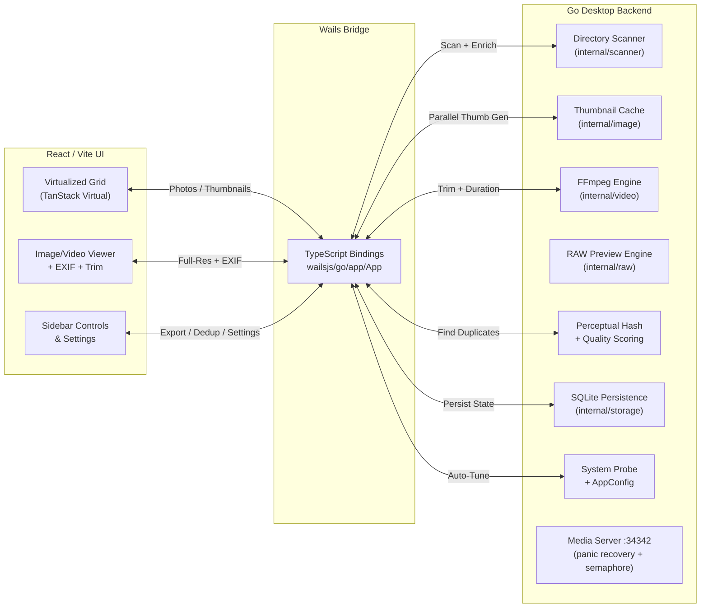

<p align="center">
  
</p>

<h1 align="center">CullSnap</h1>

<p align="center">
  <strong>A blazing-fast, native desktop photo &amp; video culling tool for photographers.</strong>
</p>

<p align="center">
  <a href="go.mod"></a>
  <a href="wails.json"></a>
  <a href="https://github.com/Abhishekmitra-slg/CullSnap/releases/latest"></a>
  <a href="LICENSE"></a>
</p>

<p align="center">
  <a href="#-installation">Install</a> &middot;
  <a href="#-features">Features</a> &middot;
  <a href="#-usage-guide">Usage</a> &middot;
  <a href="#-architecture">Architecture</a> &middot;
  <a href="#-contributing">Contributing</a> &middot;
  <a href="#-license">License</a> &middot;
  <a href="https://github.com/Abhishekmitra-slg/CullSnap/releases/latest">Download</a>
</p>

---

CullSnap lets photographers review, rate, deduplicate, and export thousands of photos and videos from a single native window. The Go backend handles heavy lifting (perceptual hashing, parallel thumbnail generation, FFmpeg video trimming) while the React frontend delivers a responsive glassmorphism UI with virtualized scrolling.

## ✨ Features

-   **Fast Photo & Video Grid**: Virtualized grid layout (TanStack Virtual, ~52 DOM nodes max) with cached disk thumbnails for buttery-smooth scrolling through 1000s of assets. RAW files display format badges (CR3, ARW, NEF, etc.) directly on thumbnails.
-   **Video Support**: Native support for MP4, MOV, WEBM, MKV, and AVI. Includes background duration extraction, frame-accurate thumbnail generation, and lossless trim-on-export via FFmpeg fast-seek.
-   **Native Apple Silicon Support**: Automatically provisions native `arm64` FFmpeg and FFprobe binaries on Apple Silicon Macs, delivering maximum performance without Rosetta 2.
-   **Disk-Based Thumbnail Cache**: Parallel Go goroutines generate 300px JPEG thumbnails to `~/.cullsnap/thumbs/` with secure permissions. Worker count is auto-tuned from hardware and user-configurable.
-   **Smart Deduplication**: Pure-Go perceptual hashing (dHash) automatically groups duplicate/burst photos and selects the sharpest image using a Laplacian Variance algorithm.
-   **RAW Image Support**: Native support for 11 camera RAW formats — CR2, CR3, ARW, NEF, DNG, RAF, RW2, ORF, NRW, PEF, SRW. Extracts embedded JPEG previews using a Pure Go TIFF IFD parser (Canon/Sony/Nikon/Leica) with dcraw fallback for Fujifilm, Panasonic, Olympus, and others. Includes RAW+JPEG companion pairing and format badges in the UI.
-   **JPEG & PNG Processing**: High-performance embedded thumbnail extraction with EXIF-aware orientation and parallel goroutine generation.
-   **EXIF Metadata**: Frosted-glass overlay card displaying Camera, Lens, ISO, Aperture, Shutter Speed, and Date Taken.
-   **Stable Media Architecture**: Dedicated high-speed server on port `34342` with panic recovery, connection semaphore, structured shutdown, and MIME-correct headers for all video formats.
-   **Custom Export Pathing**: Inline dialog for naming export folders on-the-fly. Post-export, selections auto-clear (blue ticks) and exported files show green ticks on reload.
-   **Star Ratings**: 1–5 star rating system persisted to SQLite for each photo and video.
-   **Auto-Tuned Performance**: System probe detects CPU cores, RAM, storage type (SSD/HDD), and file descriptor limits. Settings modal exposes MaxConnections, ThumbnailWorkers, and ScannerWorkers sliders.
-   **Resource Monitoring**: Real-time CPU, RAM, Disk I/O, and Network tracking in the status bar.

## 🏗️ Architecture

CullSnap natively binds a high-performance **Go** backend to a modern **React/Vite** frontend using the **Wails Framework**.



## 🛠️ Installation

### Direct Download

Pre-built binaries for all platforms are available on the [Releases](https://github.com/Abhishekmitra-slg/CullSnap/releases/latest) page:

| Platform | File | Notes |
|----------|------|-------|
| **macOS** (Intel & Apple Silicon) | `CullSnap-macos-universal.zip` | Universal binary, works on all Macs |
| **Windows** (64-bit) | `CullSnap-windows-amd64.exe` | Standalone executable |
| **Linux** (64-bit) | `CullSnap-linux-amd64` | Requires GTK3 + WebKit2GTK |

### 🍎 macOS via Homebrew (Recommended)
The easiest way to install on macOS and bypass Gatekeeper warnings:

```bash
brew tap abhishekmitra-slg/tap
brew install --cask cullsnap
```

---

### 🍎 Manual macOS Installation (Troubleshooting)
If you download the `.zip` manually instead of using Homebrew, macOS will flag it with *"Apple could not verify CullSnap is free of malware."*

To run the manually downloaded app:
1. Open your Terminal.
2. Run:
```bash
xattr -cr /Applications/CullSnap.app
```

### Building from Source
Ensure you have [Go 1.25+](https://go.dev/) and Node.js 22+ installed. Then install the Wails CLI:
```bash
go install github.com/wailsapp/wails/v2/cmd/wails@latest
```

To build a Native Application Bundle (`.app` for Mac):
```bash
make build
# Output lands in ./build/bin/CullSnap.app
```

To run in Developer Watch-Mode:
```bash
make dev
```

## 🎮 Usage Guide

1.  **Open Folder**: Click **Open Folder** to load a directory from your machine or external drive. CullSnap automatically detects JPEG, PNG, RAW, and video files.
2.  **Deduplicate**: Click **Find Duplicates** to automatically group burst shots and isolate the sharpest unique photos. Previously deduped folders are auto-detected.
3.  **Navigate**: Use `← / →` or `↑ / ↓` arrow keys to traverse through photos. The virtualized grid auto-scrolls to keep the active photo visible.
4.  **Rate**: Click the stars (1–5) on any thumbnail to rate photos.
5.  **Cull**: Press `S` to toggle keeping the photo (Blue Checkmark).
6.  **Trim Videos**: Select a video, set trim start/end in the viewer. Only the trimmed segment is exported (lossless fast-seek).
7.  **Review**: The grid provides instant visual feedback — Blue Checkmarks for selections, Green Checkmarks for previously exported files.
8.  **EXIF**: Select any asset to view its metadata in the frosted-glass overlay.
9.  **Export**: Click **Export (N)**. Choose a destination, name the folder in the inline dialog, and CullSnap copies all full-resolution originals and trimmed videos to the new folder.
10. **Settings**: Click the gear icon to view system info (OS, CPU, RAM, Storage, FFmpeg) and adjust performance tuning sliders.

## 📷 Supported Formats

| Category | Formats |
|----------|---------|
| **Images** | JPG, JPEG, PNG |
| **RAW** | CR2 (Canon DSLR), CR3 (Canon mirrorless), ARW (Sony), NEF (Nikon), DNG (Adobe/Leica/Ricoh), RAF (Fujifilm), RW2 (Panasonic), ORF (Olympus/OM System), NRW (Nikon compact), PEF (Pentax), SRW (Samsung) |
| **Video** | MP4, MOV, WEBM, MKV, AVI (requires FFmpeg) |

RAW files are displayed with format badges in both the grid and viewer. When RAW+JPEG pairs are detected (same filename, same directory), CullSnap automatically links them as companions.

> **Note:** Some RAW formats (RAF, RW2, ORF, NRW, PEF, SRW) require dcraw for preview extraction. CullSnap will attempt to provision dcraw automatically; if unavailable, these formats will be skipped while CR2, ARW, NEF, and DNG continue to work via the built-in Pure Go parser.

## 📁 Project Structure

```
CullSnap/
├── main.go                         # Wails entry, media server, panic recovery
├── internal/
│   ├── app/
│   │   ├── app.go                  # Core app logic, all Wails-bound methods
│   │   ├── config.go               # SystemProbe, AppConfig, DeriveDefaults
│   │   ├── config_unix.go          # FD limit detection (Unix)
│   │   ├── config_windows.go       # FD limit detection (Windows)
│   │   └── config_ram.go           # RAM detection (gopsutil)
│   ├── video/
│   │   └── ffmpeg.go               # FFmpeg/FFprobe provisioning, trim, thumbnails
│   ├── image/
│   │   ├── thumbnail.go            # EXIF thumbnail extraction + resize fallback
│   │   └── thumbcache.go           # Disk cache with parallel batch generation
│   ├── raw/                        # RAW image support (TIFF parser, dcraw, preview cache)
│   ├── scanner/scanner.go          # Directory walker (jpg/jpeg/png + RAW + video)
│   ├── dedupe/                     # dHash perceptual hashing + Laplacian Variance
│   ├── export/copier.go            # File copy with flush-error checking + video trim
│   ├── model/photo.go              # Unified Photo struct
│   ├── storage/                    # SQLite (selections, ratings, exported, config)
│   └── logger/                     # Structured logging (slog)
└── frontend/src/
    ├── App.tsx                      # 2-phase loading, event listeners, state
    ├── components/
    │   ├── Grid.tsx                 # Virtualized grid (TanStack Virtual)
    │   ├── Viewer.tsx               # Image/Video viewer + trim controls
    │   ├── Sidebar.tsx              # Folder nav, export dialog, dedup trigger
    │   └── SettingsModal.tsx        # System info + performance sliders
    └── index.css                    # Navy/violet theme, glassmorphism, animations
```

## 🔒 Security

Found a vulnerability? Please report it privately — see [SECURITY.md](SECURITY.md) for the responsible disclosure policy. **Do not open public issues for security bugs.**

## 🤝 Contributing

Contributions are welcome! Please see [CONTRIBUTING.md](CONTRIBUTING.md) for details.

All contributors must sign a [Contributor License Agreement (CLA)](COMMERCIAL-LICENSE.md#contributor-license-agreement-cla) before their first PR can be merged.

## 📄 License

CullSnap is dual-licensed:

- **Open Source**: [GNU Affero General Public License v3.0 (AGPLv3)](LICENSE) — free to use, modify, and distribute under AGPLv3 terms. All derivative works must also be released under AGPLv3.
- **Commercial**: A commercial license is available for organizations that cannot comply with AGPLv3. See [COMMERCIAL-LICENSE.md](COMMERCIAL-LICENSE.md) for details.

## ⚖️ Code of Conduct

This project follows the [Contributor Covenant v2.1](CODE_OF_CONDUCT.md). Please read it before participating.
