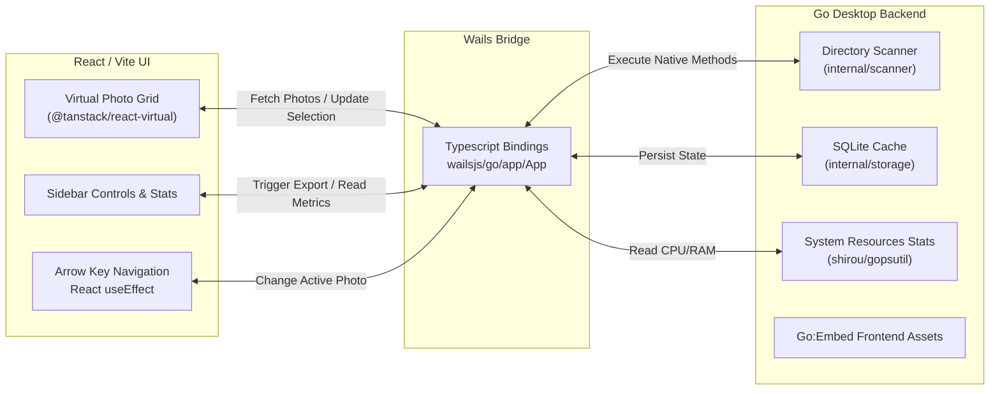

# CullSnap 📸

[](go.mod)
[](wails.json)
[](LICENSE)

**CullSnap** is a high-performance, native desktop tool designed for photographers to cull and select thousands of high-resolution photos in seconds. Initially built on Fyne, the application has been ported to the **Wails Framework with a React/Vite frontend** to deliver a stunning MacOS glassmorphism experience with virtualized DOM scrolling.

## ✨ Features

-   **Infinite Virtual Grid**: Built with `@tanstack/react-virtual` to effortlessly scroll through directories of 10,000+ photos using less than 30MB of Engine RAM.
-   **RAW & JPEG Processing**: High-performance backend embedded thumbnail extraction for RAW camera files.
-   **Intelligent Syncing**: Backend SQLite tagging automatically saves your Culling progress seamlessly across app restarts.
-   **Resource Monitoring**: Real-time MacOS Application Engine Memory, CPU, Disk I/O, and Network tracking built directly into the UI.
-   **Export Ready**: One-click bulk export of selected photos to any destination directory without destructive file moving.

## 🏗️ Architecture

CullSnap natively binds a high-performance **Go** backend to a modern **React/Vite** frontend using the **Wails Framework**.



## 🛠️ Installation & Build

Ensure you have [Go](https://go.dev/) and Node/NPM installed. Then install the Wails CLI:

```bash
go install github.com/wailsapp/wails/v2/cmd/wails@latest
```

To build a Native Application Bundle (`.app` for Mac):
```bash
make build
# Output lands in ./build/bin/CullSnap.app
```

To run in Developer Watch-Mode:
```bash
make dev
```

## 🎮 Usage Guide

1.  **Open Folder**: Click the Folder icon to load a directory on your machine.
2.  **Navigate**: Use `Arrows ← / →` or `↑ / ↓` to instantly traverse through photos.
3.  **Cull**: Press `S` to toggle keeping the photo (indicated by a Blue Checkmark).
4.  **Review**: Grid provides instant visual feedback on your selections and highlights previously exported files (Green Checkmark).
5.  **Export**: Click the **Export (N)** button in the sidebar to copy all selected photos to a separate delivery folder on your drive.

## 🤝 Contributing
We welcome contributions! Please see [CONTRIBUTING.md](CONTRIBUTING.md) for details.

## 📄 License
This project is licensed under the MIT License - see the [LICENSE](LICENSE) file for details.
