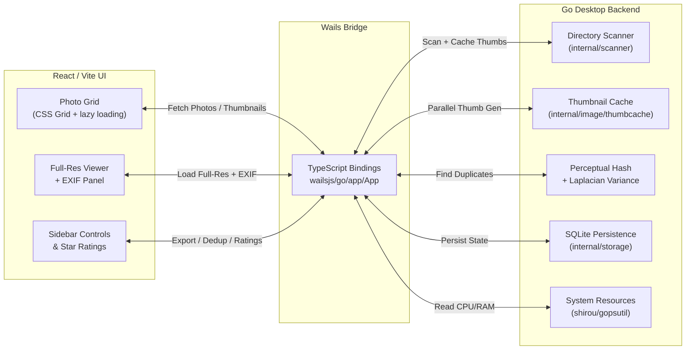

# CullSnap 📸

[](go.mod)
[](wails.json)
[](LICENSE)

**CullSnap** is a high-performance, native desktop tool designed for photographers to cull and select thousands of high-resolution photos in seconds. Built with the **Wails Framework** (Go backend + React/Vite frontend) delivering a stunning dark-mode glassmorphism experience.

## ✨ Features

-   **Fast Photo Grid**: CSS Grid layout with lazy loading and cached disk thumbnails for buttery-smooth scrolling through 1000+ photos.
-   **Disk-Based Thumbnail Cache**: Parallel Go goroutines generate 300px JPEG thumbnails to `~/.cullsnap/thumbs/` with secure permissions (0700/0600). Cached thumbnails load instantly on revisit.
-   **Smart Deduplication**: Pure-Go perceptual hashing automatically groups duplicate/burst photos and selects the sharpest image using a Laplacian Variance algorithm. Auto-detects previous dedup results.
-   **RAW & JPEG Processing**: High-performance embedded thumbnail extraction for RAW camera files (CR2, CR3, ARW, NEF, DNG).
-   **EXIF Metadata**: Frosted-glass overlay card displaying Camera, Lens, ISO, Aperture, Shutter Speed, and Date Taken with aligned grid layout.
-   **Star Ratings**: 1–5 star rating system persisted to SQLite for each photo.
-   **Folder Navigation**: Click any folder name in the sidebar to open it directly in Finder/Explorer.
-   **Intelligent Syncing**: SQLite backend saves culling progress, ratings, and export status across app restarts.
-   **Resource Monitoring**: Real-time CPU, RAM, Disk I/O, and Network tracking in the status bar.
-   **Export Ready**: One-click bulk export of selected photos (always uses full-resolution originals, never thumbnails).
-   **Shimmer Loading**: Cards display a subtle shimmer animation while thumbnails load, stopping individually as each image appears.

## 🏗️ Architecture

CullSnap natively binds a high-performance **Go** backend to a modern **React/Vite** frontend using the **Wails Framework**.



## 🛠️ Installation

### 🍎 macOS (Recommended)
The easiest way to install CullSnap on macOS and bypass Gatekeeper warnings is via Homebrew:

```bash
brew tap abhishekmitra-slg/tap
brew install --cask cullsnap
```

### 🪟 Windows & 🐧 Linux
Download the latest binary from the [Releases](https://github.com/Abhishekmitra-slg/CullSnap/releases) page.

---

### 🍎 Manual macOS Installation (Troubleshooting)
If you download the `.zip` manually instead of using Homebrew, macOS will flag it with *"Apple could not verify CullSnap is free of malware."*

To run the manually downloaded app:
1. Open your Terminal.
2. Run:
```bash
xattr -cr /Applications/CullSnap.app
```

### Building from Source
Ensure you have [Go](https://go.dev/) and Node/NPM installed. Then install the Wails CLI:
```bash
go install github.com/wailsapp/wails/v2/cmd/wails@latest
```

To build a Native Application Bundle (`.app` for Mac):
```bash
make build
# Output lands in ./build/bin/CullSnap.app
```

To run in Developer Watch-Mode:
```bash
make dev
```

## 🎮 Usage Guide

1.  **Open Folder**: Click **Open Folder** to load a directory from your machine or external drive.
2.  **Deduplicate**: Click **Find Duplicates** to automatically group burst shots and isolate the sharpest unique photos. Previously deduped folders are auto-detected.
3.  **Navigate**: Use `← / →` or `↑ / ↓` arrow keys to traverse through photos.
4.  **Rate**: Click the stars (1–5) on any thumbnail to rate photos.
5.  **Cull**: Press `S` to toggle keeping the photo (Blue Checkmark).
6.  **Review**: The grid provides instant visual feedback — Blue Checkmarks for selections, Green Checkmarks for previously exported files.
7.  **EXIF**: Select any photo to view its EXIF metadata in the frosted-glass overlay.
8.  **Export**: Click **Export (N)** to copy all selected photos (full resolution) to a delivery folder.

## 📁 Project Structure

```
CullSnap/
├── main.go                      # Wails app entry + FileLoader asset handler
├── internal/
│   ├── app/app.go              # Core app logic, all Wails-bound methods
│   ├── image/
│   │   ├── thumbnail.go        # EXIF thumbnail extraction + resize fallback
│   │   └── thumbcache.go       # Disk-based thumbnail cache (parallel workers)
│   ├── scanner/scanner.go      # Directory walker
│   ├── dedupe/                 # Perceptual hashing + quality scoring
│   ├── export/                 # Photo export logic
│   ├── model/photo.go          # Photo struct (Path, ThumbnailPath, EXIF, etc.)
│   ├── storage/                # SQLite persistence
│   └── logger/                 # Structured logging
└── frontend/src/
    ├── App.tsx                 # Main app with 2-phase loading
    ├── components/
    │   ├── Grid.tsx            # Photo grid with shimmer + lazy loading
    │   ├── Viewer.tsx          # Full-res viewer + EXIF panel
    │   └── Sidebar.tsx         # Controls, folders, dedup status
    └── index.css               # Dark theme, glassmorphism, animations
```

## 🤝 Contributing
We welcome contributions! Please see [CONTRIBUTING.md](CONTRIBUTING.md) for details.

## 📄 License
This project is licensed under the MIT License - see the [LICENSE](LICENSE) file for details.
